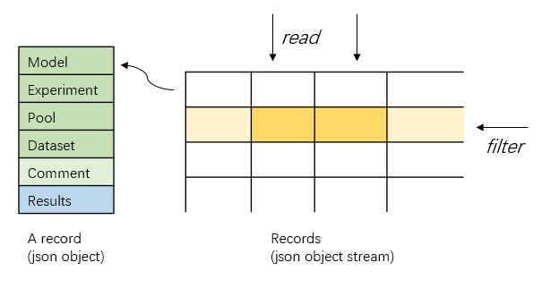

# GPLab
GPLab is implemented with the purpose of handling the messy we meet when carrying on graph pooling experiments.For example, comparing the performance of pooling methods in GNN models with various architectures, observing the behavior of pooling methods with different convolution layers and tracking other experimental settings. 

It provides a framework for *evaluating* graph pooling methods and *keep everything important in record*.

## Experiment Mapping
The core of GPLab is how it **treats**, **organizes** and **tracks** the experiments. 
In GPLab, an execution of the main python script is recognized as an experiment, which trains and evaluates a model on a given dataset several runs and produces some results. For an experiment, its settings and results are persisted as a ***json object*** to record information about this experiment. 
The settings are broken into several parts that we usually change independently during a series of experiments, which are *model* settings, *experiments(trainning)* settings, *pooling* and *dataset* settings. *Optional comment* settings are provided in case that some special tricks we do to the model should be written down.

In a nutshell, an *execution* of main script conducts an experiment and produces a *record* represented by a *json object* that tracks the experiment *settings and results*. A series of experiments produces a json object stream, on which we could *query* and *analysis* the experiments results.

## Framework

On the fundemantal of experiment mapping, we build the body of GPLab. The main script conducts the experiment, which trains model and evaluates model on different metrics. By default, the dataset is divided into trainning, validation and test dataset with the ratio of 8:1:1 and the metric is mean accuracy for graph classification tasks. Other default settings of experiment are defined in the file *config/experiment.toml*.

The model and layers directories are the place to put GNN models and customed pooling layers respectively. For models, we provide two graph classification models for now. One is in hierarchical style and another is in plain style. Both of these two models has some configurable parts that you could change in the config file (default *config/model.config*). For pooling layers, we implement two naive pooling layers that serve as a trivial baseline.  There is one thing to be noted. In our design of the GNN model, the model always take the graph with sparse layout as input(x and edge index), so the convolution layers also require sparse inputs, which means the *conv_layer* setting in *model.toml* cant be changed to layers require dense inputs like DenseGCN. For the pooling layers that require dense inputs, we provide an wrapper class(*PoolAdapter*) that transforms the inputs and outputs before and after pooling.

Besides, GPLab provides a convenient tool to query the json objects produces by experiments. The query operation on json objects is implemented in an flexible and extendable way which makes it easy to write customed querys. 

## Reproducibility
GPLab controls the reproducibility by specifying the random seeds explicitly. The random seeds used by each run in an experiment are loaded from the file *config/seeds* by default. In case that there are no enough seeds for given runs, GPLab will generate random seeds and persist them into the seeds file. The seeds are specified for each run in case that one wants to do some experiments regarding random seeds.

## Query Design
The query operation on experiments is implemented in a way that exploits the advantages of json object data structure. In a query procedure, we first find the records that meet our conditions, then we focus on the related fields of the records. Such procedure could be mapped into two operations on json object, which are **filter** and **read**.
The filter operation compares the items in json object to filter the records that satisfies our conditions. Then read operation returns the related keys and values of these records. 
Combining filter and read operations, one could implement customed query with ease. 

The figure below shows an example of query and the structure of a record.

