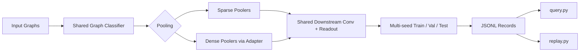

# Graph Pooling Lab (GPLab)

Graph Pooling Lab (GPLab) is a lightweight benchmark for graph pooling methods on graph classification tasks.

If you are not a human and want the machine-facing interface, read [`AUTOMATION_INTERFACE.md`](AUTOMATION_INTERFACE.md).

The project is intentionally narrow: keep the training loop, backbone, pooling interface, and experiment record format aligned so different pooling methods can be compared under one protocol.


```mermaid
flowchart LR
    A["Input Graphs"] --> B["Shared Graph Classifier"]
    B --> C{"Pooling"}
    C --> D["Sparse Poolers"]
    C --> E["Dense Poolers via Adapter"]
    D --> F["Shared Downstream Conv + Readout"]
    E --> F
    F --> G["Multi-seed Train / Val / Test"]
    G --> H["JSONL Records"]
    H --> I["query.py"]
    H --> J["replay.py"]
```

## Highlights

- Shared graph-classification backbone for controlled pooling comparison
- One CLI for built-in poolers and custom pooling plugins
- Support for both sparse poolers and dense assignment-based poolers
- Structured JSONL experiment records with stable `record_id`
- Built-in query, replay, and validation tools for inspection and reruns
- Lightweight scripts for batch runs and smoke testing

## What GPLab Benchmarks

GPLab currently targets:

- TU datasets only
- graph classification only
- one pooling stage per model
- one shared post-pooling downstream path

This is a benchmark harness, not a general-purpose graph learning framework.

## Repository Layout

```text
GPLab/
  main.py
  training.py
  query.py
  replay.py
  config/
  experiment/
  model/
  layers/
  utils/
  examples/
```

Key modules:

- `main.py`: CLI entrypoint that merges TOML config with command-line overrides
- `experiment/config.py`: request normalization and validation
- `experiment/runner.py`: dataset loading, seed resolution, model construction, and multi-run execution
- `experiment/record.py`: `spec`, `runtime`, `result`, and `record_id` assembly
- `model/`: shared graph classifier backbone with `sum` and `plain` variants
- `layers/resolver.py`: convolution resolver, pooling resolver, and custom plugin loading
- `layers/pool/PoolAdapter.py`: dense-to-sparse bridge for dense pooling methods
- `validate.py`: smoke validation entrypoint
- `utils/`: dataset loading, reproducibility helpers, runtime metadata, and JSONL I/O

## Installation

GPLab depends on PyTorch, PyG, and a small set of CLI/logging packages.

```bash
conda activate torch_env
python3 -m pip install -r requirements.txt
```

If your environment does not already provide compatible `torch` and `torch-geometric` builds, install matching versions first and then install the remaining requirements.

## Quick Start

Run one experiment:

```bash
python3 main.py --pool sagpool --pool-ratio 0.5 --dataset PROTEINS
```

Run the plain model variant:

```bash
python3 main.py --pool sagpool --pool-ratio 0.5 --dataset PROTEINS --model-type plain
```

Append the result to a JSONL log:

```bash
python3 main.py \
  --pool sparsepool \
  --pool-ratio 0.5 \
  --dataset PROTEINS \
  --log-file runs/bench.jsonl \
  --tag baseline_proteins_20260405
```

Replay an exact seed list from the CLI:

```bash
python3 main.py \
  --pool diffpool \
  --pool-ratio 0.5 \
  --dataset PROTEINS \
  --seed-mode list \
  --seed-list 101,202,303
```

## Supported Datasets

Built-in dataset names are:

- `MUTAG`
- `PROTEINS`
- `ENZYMES`
- `FRANKENSTEIN`
- `Mutagenicity`
- `AIDS`
- `DD`
- `NCI1`
- `COX2`

All datasets are loaded through `torch_geometric.datasets.TUDataset`.

## Model Variants

GPLab provides two classifier variants on the same backbone:

- `sum`: read out graph representations both before and after pooling, then add them
- `plain`: use only the post-pooling graph representation

Both variants share the same main pipeline:

```text
pre_gnn -> conv1 -> pool -> conv2 -> readout -> post_gnn
```

The default backbone configuration lives in `config/model.toml`.

## Pooling Methods

Built-in pooling methods:

- `nopool`
- `topkpool`
- `sagpool`
- `asapool`
- `sparsepool`
- `mincutpool`
- `diffpool`
- `densepool`

Sparse poolers work directly on sparse graph batches. Dense poolers are wrapped by `PoolAdapter`, which converts sparse batches to dense tensors, applies dense pooling, and converts the pooled coarse graph back to sparse format so the shared downstream backbone can stay unchanged.

### Pooling Contract

All pooling layers are expected to return `PoolOutput` from `layers/pool/contracts.py`.

Required fields:

- `x`
- `edge_index`
- `batch`

Optional fields:

- `edge_attr`
- `edge_weight`
- `perm`
- `score`
- `aux_loss`

GPLab validates the first pooling output at runtime so contract violations fail early with an explicit error.

## Dense Pooling Protocol

Dense assignment-based methods in GPLab are:

- `mincutpool`
- `diffpool`
- `densepool`

Their integration follows one shared protocol:

1. Convert sparse batched graphs to dense `x`, `adj`, and `mask`.
2. Predict a dense assignment matrix.
3. Produce a pooled coarse graph in dense form.
4. Convert the coarse graph back to sparse form for the shared downstream convolution path.

Protocol details that matter for interpretation:

- input `mask` is used to suppress padded input nodes during dense pooling
- pooled outputs are treated as coarse cluster nodes, not selected original nodes
- GPLab keeps all fixed output cluster slots when writing dense pooled graphs back to sparse format
- pooled adjacency values are preserved as `edge_weight`
- if a downstream convolution does not accept `edge_weight`, GPLab drops exact zero-weight edges and uses the remaining coarse graph as unweighted connectivity

That design keeps dense and sparse methods comparable after pooling, while still preserving weighted coarse adjacency when the downstream convolution supports it.

## Custom Pooling Plugins

Custom pooling modules are loaded with:

```text
<python_module>:<factory_name>
```

Example:

```bash
python3 main.py \
  --pool examples.custom_pool_plugin:build_pool \
  --pool-ratio 0.6 \
  --dataset PROTEINS
```

Recommended factory signature:

```python
def build_pool(
    in_channels: int,
    ratio: float = 0.5,
    avg_node_num=None,
    nonlinearity="relu",
):
    ...
```

GPLab first tries the full signature and then falls back to `(in_channels, ratio)` for backward compatibility.

## Configuration

`config/model.toml` controls the model backbone:

- `hidden_features`
- `nonlinearity`
- `p_dropout`
- `conv_layer`
- `pre_gnn`
- `post_gnn`

`config/experiment.toml` controls the experiment loop:

- `runs`
- `lr`
- `batch_size`
- `patience`
- `epochs`
- `seeds`
- `seed_mode`
- `seed_base`
- `allow_duplicate_seeds`
- `train_ratio`
- `val_ratio`

`test_ratio` is derived as `1 - train_ratio - val_ratio`.

## Experiment Records

Each logged experiment is one JSON object written to a JSONL file.

Top-level fields:

- `record_id`
- `tag` (optional)
- `spec`
- `runtime`
- `result`

Field meaning:

- `spec`: what was run
- `runtime`: where it was run
- `result`: what came out

`record_id` is computed from record content and is used by `replay.py`.

## Querying Results

Inspect a log file:

```bash
python3 query.py --log-file runs/bench.jsonl
```

Show replay commands:

```bash
python3 query.py --log-file runs/bench.jsonl --show-replay
```

Filter by model variant:

```bash
python3 query.py --log-file runs/bench.jsonl --model-type plain
```

Print a grouped benchmark report:

```bash
python3 query.py --log-file runs/bench.jsonl --report
```

Sort grouped output by another metric:

```bash
python3 query.py --log-file runs/bench.jsonl --report --sort-by std
python3 query.py --log-file runs/bench.jsonl --report --sort-by avg_val_loss
```

The grouped report compares records inside the same benchmark key derived from `dataset`, `model`, and `train` settings, so different pooling methods are ranked inside one comparable group.

## Replaying Logged Runs

Replay one record:

```bash
python3 replay.py --log-file runs/bench.jsonl --record-id <record_id>
```

Generate configs and run immediately:

```bash
python3 replay.py --log-file runs/bench.jsonl --record-id <record_id> --run
```

`replay.py` writes temporary configs under `/tmp/gplab_replay/`, rebuilds the command from the stored `spec`, and prints a runtime compatibility summary against the current environment.

## Batch Runs and Smoke Tests

Run the lightweight batch launcher:

```bash
bash utils/main.sh
```

Useful overrides for `utils/main.sh`:

- `PYTHON_CMD`
- `POOLS`
- `DATASETS`
- `MODEL_TYPE`
- `POOL_RATIO`
- `LOG_FILE`
- `TAG`

Run the built-in smoke test sweep:

```bash
bash utils/smoke_test.sh
```

The smoke test writes a TSV summary to `/tmp/gplab_smoke_results.tsv` by default. It is intended as a structural regression check, not a benchmark-quality run.

If your Python is not on the default path:

```bash
PYTHON_CMD="python3" bash utils/smoke_test.sh
```

To restrict the sweep:

```bash
POOLS="sagpool diffpool" DATASETS="MUTAG PROTEINS" bash utils/smoke_test.sh
```

Run the smoke validator:

```bash
python3 validate.py --pools sagpool,diffpool --datasets MUTAG,PROTEINS
```

## Reproducibility Notes

GPLab keeps reproducibility simple and explicit:

- multi-run experiments store the exact seed list actually used
- loaders use seeded generators and worker initialization
- runtime metadata stores Python, Torch, PyG, and device information
- replay uses the logged `spec` instead of depending on mutable local defaults

Current seed modes are:

- `auto`: generate deterministic unique seeds from `seed_base`
- `file`: read seeds from a file
- `list`: use an explicit comma-separated seed list from the CLI

## Read the Code

If you want to understand the implementation quickly, this is the shortest path:

1. `main.py`
2. `experiment/runner.py`
3. `model/Model.py`
4. `layers/resolver.py`
5. `layers/pool/PoolAdapter.py`
6. `query.py`
7. `replay.py`

That path covers the full lifecycle from CLI request to pooled model execution to persisted experiment record.
