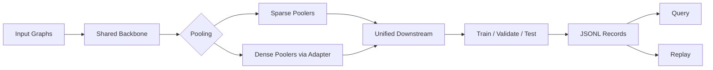
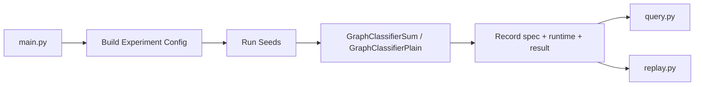
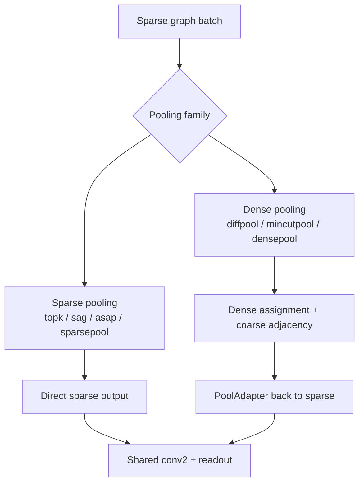

# GPLab

GPLab is a lightweight benchmark project for graph pooling methods on graph classification tasks.

Its purpose is simple: keep the training protocol, backbone, dataset handling, and logging format consistent so different pooling methods can be compared under the same setup.


```mermaid
flowchart LR
    A["Input Graphs"] --> B["Shared Backbone"]
    B --> C{"Pooling"}
    C --> D["Sparse Poolers"]
    C --> E["Dense Poolers via Adapter"]
    D --> F["Unified Downstream"]
    E --> F
    F --> G["Train / Validate / Test"]
    G --> H["JSONL Records"]
    H --> I["Query"]
    H --> J["Replay"]
```

## At A Glance


```mermaid
flowchart LR
    A["main.py"] --> B["Build Experiment Config"]
    B --> C["Run Seeds"]
    C --> D["GraphClassifierSum / GraphClassifierPlain"]
    D --> E["Record spec + runtime + result"]
    E --> F["query.py"]
    E --> G["replay.py"]
```

## What GPLab Does

GPLab focuses on four things:

- run graph classification experiments with a fixed backbone;
- swap pooling methods from the command line;
- support both built-in and custom pooling modules;
- record each experiment as a structured JSONL entry for later querying.

This makes GPLab a compact pooling benchmark harness rather than a general training framework.

## Core Design

GPLab uses one shared graph-classification backbone and one shared experiment loop.

The key design choice is the pooling protocol:

- sparse pooling methods run directly on sparse graph batches;
- dense pooling methods are adapted through a dense-to-sparse bridge so they can reuse the same downstream sparse backbone.

This keeps the post-pooling computation path aligned across methods and improves comparability.

## Pooling Protocol


```mermaid
flowchart TD
    A["Sparse graph batch"] --> B{"Pooling family"}
    B --> C["Sparse pooling<br/>topk / sag / asap / sparsepool"]
    B --> D["Dense pooling<br/>diffpool / mincutpool / densepool"]
    C --> E["Direct sparse output"]
    D --> F["Dense assignment + coarse adjacency"]
    F --> G["PoolAdapter back to sparse"]
    E --> H["Shared conv2 + readout"]
    G --> H
```

## Project Layout

```text
GPLab/
  main.py                    # CLI entrypoint
  experiment/
    config.py                # experiment request normalization
    runner.py                # experiment orchestration
    record.py                # spec/runtime/result record assembly
  training.py                # training and evaluation loops
  query.py                   # JSONL query tool
  replay.py                  # replay one JSONL record via temp configs
  model/
    Model.py                 # shared graph classifier backbone
    classifier_sum.py        # sum model variant
    classifier_plain.py      # plain model variant
  layers/
    resolver.py              # conv/pool resolver and plugin loading
    functional.py            # readout and pooling helpers
    pool/
      contracts.py           # PoolOutput contract and validation
      PoolAdapter.py         # dense pooling adapter
      SAGPool.py             # customized SAG pooling
      SparsePool.py          # custom sparse pooling
  utils/
    dataset.py               # TU dataset loading and splitting
    reproducibility.py       # seeds, loaders, runtime determinism
    data.py                  # dense/sparse conversion helpers
    io.py                    # runtime metadata and experiment printing
    jsonl.py                 # JSONL I/O
    smoke_test.sh            # built-in pool x dataset smoke test
  config/
    model.toml               # model defaults
    experiment.toml          # experiment defaults
    seeds                    # optional seed file for file mode
  examples/
    custom_pool_plugin.py    # custom pooling example
    logs/                    # sample logs
```

## Installation

GPLab depends on PyTorch, PyG, and a small set of CLI/logging utilities.

Example setup:

```bash
python3 -m venv .venv
source .venv/bin/activate
pip install -r requirements.txt
```

## Quick Start

Run one experiment:

```bash
python3 main.py --pool sagpool --pool-ratio 0.5 --dataset PROTEINS
```

Run the plain model instead of the sum model:

```bash
python3 main.py --pool sagpool --pool-ratio 0.5 --dataset PROTEINS --model-type plain
```

`--model-type` is persisted in experiment logs as `spec.model.variant`, so `sum`
and `plain` runs remain distinguishable in JSONL records and downstream queries.

Append the result to a JSONL file:

```bash
python3 main.py \
  --pool sparsepool \
  --pool-ratio 0.5 \
  --dataset PROTEINS \
  --log-file runs/bench.jsonl \
  --tag baseline_proteins_20260331
```

Recommended `--tag` style:

- use short, shell-safe tokens such as `baseline_proteins_20260331`
- avoid separators such as `;`, `|`, `&`, or nested quotes when launching through multiple shells

Replay an exact logged seed sequence without depending on `config/seeds`:

```bash
python3 main.py \
  --pool sparsepool \
  --pool-ratio 0.5 \
  --dataset PROTEINS \
  --seed-mode list \
  --seed-list 101,202,303
```

Batch script example:

```bash
bash utils/main.sh
```

`utils/main.sh` is a small batch launcher for repeated pool x dataset runs. It
can be customized with `PYTHON_CMD`, `POOLS`, `DATASETS`, `MODEL_TYPE`,
`POOL_RATIO`, `LOG_FILE`, and `TAG`.

Run a built-in smoke test across all built-in pools and TU datasets:

```bash
bash utils/smoke_test.sh
```

`utils/smoke_test.sh` is a structural regression check. It writes a TSV summary
to `/tmp/gplab_smoke_results.tsv` by default and does not append JSONL
experiment records.

If you want smoke runs to also emit JSONL records, pass `LOG_FILE`:

```bash
LOG_FILE=runs/smoke.jsonl TAG_PREFIX=smoke PYTHON_CMD="python3" bash utils/smoke_test.sh
```

To limit the sweep, override `POOLS` or `DATASETS`:

```bash
POOLS="sagpool diffpool" DATASETS="MUTAG PROTEINS" bash utils/smoke_test.sh
```

If your environment does not expose the correct Python by default, pass it explicitly:

```bash
PYTHON_CMD="python3" bash utils/smoke_test.sh
```

## Querying Logs

Query a JSONL log file:

```bash
python3 query.py --log-file runs/bench.jsonl
```

Default query output now uses one unified record summary schema. Each matched
record includes:

- `record_id`
- `dataset`
- `pool`
- `pool_ratio`
- `model_type`
- `tag` when present
- `runs`
- `mean`
- `std`
- `avg_best_epoch`
- `avg_val_loss`
- `val_loss_test_acc_corr`

Show the replay command for each matched record:

```bash
python3 query.py --log-file runs/bench.jsonl --show-replay
```

Filter by model variant:

```bash
python3 query.py --log-file runs/bench.jsonl --model-type plain
```

`query.py` reads `spec.model.variant` from each record.

Show the full `spec` block for matched records:

```bash
python3 query.py --log-file runs/bench.jsonl --show-spec
```

Print a grouped benchmark-style report:

```bash
python3 query.py --log-file runs/bench.jsonl --report
```

`--report` groups matched records by one benchmark key derived from:

- `spec.dataset`
- `spec.model`
- `spec.train`

It intentionally excludes `spec.pool`, so different pooling methods are ranked
inside the same comparable benchmark group.

Sort the grouped report by stability or validation loss instead of mean:

```bash
python3 query.py --log-file runs/bench.jsonl --report --sort-by std
python3 query.py --log-file runs/bench.jsonl --report --sort-by avg_val_loss
```

Recommended benchmark comparison template:

- keep `dataset`, `model`, and `train` settings aligned before comparing pools
- compare `mean` first, then read `std` as the stability signal
- use `avg_best_epoch` to understand early-stop behavior rather than quality by itself
- read `avg_val_loss` together with `val_loss_test_acc_corr`
- if validation loss is low but `test_acc` is unstable or correlation is weak, treat the conclusion as less reliable

Recommended `tag` convention:

- use short shell-safe tags such as `baseline_proteins_20260402`
- keep one experiment family on one tag when possible
- if extra structure is helpful, prefer flat key-value style such as `phaseD_sum_proteins_baseline`

## Reproducing a Logged Run

Each current record stores all replay-critical inputs in `spec`:

- `spec.dataset`
- `spec.model`
- `spec.pool`
- `spec.train.seeds`
- `spec.train.split`
- `spec.train.lr`
- `spec.train.batch_size`
- `spec.train.patience`
- `spec.train.epochs`

Recommended workflow:

```bash
python3 query.py --log-file runs/bench.jsonl --show-replay
python3 replay.py --log-file runs/bench.jsonl --record-id <record_id>
python3 replay.py --log-file runs/bench.jsonl --record-id <record_id> --run
```

`replay.py` writes temporary configs under `/tmp/gplab_replay/`, then replays
the record with the exact logged seed list. It also prints a checked-field
runtime compatibility summary so you can see whether Python / Torch / PyG /
device metadata still matches the original record.

When checking whether two runs are truly comparable, compare at least:

- `spec.dataset`
- `spec.model`
- `spec.train`
- `runtime`

## Models

GPLab currently provides two model variants built on the same shared backbone:

- `sum`: reads out graph representations both before and after pooling, then adds them;
- `plain`: uses only the post-pooling graph representation.

Concrete model classes:

- `GraphClassifierSum`
- `GraphClassifierPlain`

Both models share:

- `pre_gnn`
- two graph convolution blocks
- one pooling stage
- one shared readout definition
- one post-MLP classification head

## Built-in Pooling Methods

Available built-ins:

- `nopool`
- `topkpool`
- `sagpool`
- `asapool`
- `sparsepool`
- `mincutpool`
- `diffpool`
- `densepool`

## Pooling Contract

All pooling layers are expected to return a `PoolOutput` dataclass.

Minimal required fields:

- `x`
- `edge_index`
- `batch`

Optional fields:

- `edge_attr`
- `edge_weight`
- `perm`
- `score`
- `aux_loss`

The first batch is validated through `validate_pool_output()` so format errors can fail early and clearly.

Example:

```python
from layers.pool.contracts import PoolOutput


class MyPool(torch.nn.Module):
    def forward(self, x, edge_index, batch):
        return PoolOutput(
            x=x,
            edge_index=edge_index,
            batch=batch,
            edge_attr=None,
            edge_weight=None,
            perm=None,
            score=None,
            aux_loss=None,
        )
```

## Custom Pooling Plugin

Custom pooling is loaded with:

```text
<python_module>:<factory_name>
```

Example:

```bash
python main.py \
  --pool examples.custom_pool_plugin:build_pool \
  --pool-ratio 0.6 \
  --dataset PROTEINS
```

Recommended factory signature:

```python
def build_pool(
    in_channels: int,
    ratio: float = 0.5,
    avg_node_num=None,
    nonlinearity="relu",
):
    ...
```

GPLab first tries the full signature and then falls back to `(in_channels, ratio)`.

## Dense Pooling Adapter

`mincutpool`, `diffpool`, and `densepool` are integrated through `PoolAdapter`.

The adapter does four things:

1. convert sparse batches to dense tensors;
2. compute the assignment matrix;
3. apply the dense pooling method;
4. convert the pooled coarse graph back to sparse format, including coarse adjacency weights.

This lets dense pooling methods share the same downstream sparse backbone used by sparse pooling methods.

Current dense-pooling protocol in GPLab:

- dense input `mask` is only used to exclude padded input nodes from pooling computation;
- dense output positions are interpreted as fixed coarse clusters, not as retained original nodes;
- GPLab keeps all fixed `C` coarse clusters produced by dense pooling when returning to the shared sparse downstream path;
- when the dense pooled adjacency carries real-valued coarse edge weights, GPLab preserves those weights in the adapter and forwards them to downstream `GCN` / `GraphConv` layers when supported;
- for backbones that do not consume `edge_weight`, GPLab first drops exact zero-weight coarse edges, then applies the convolution on the remaining unweighted coarse graph;
- this means weighted coarse-adjacency semantics are preserved best with `GCN` / `GraphConv`, while weight-blind backbones such as `GIN` still follow the same coarse-node protocol but lose edge-strength information.

## Configuration

### `config/model.toml`

Main model fields:

- `hidden_features`
- `nonlinearity`
- `p_dropout`
- `conv_layer`
- `pre_gnn`
- `post_gnn`
- `variant` in logged records, set from `--model-type`

### `config/experiment.toml`

Main experiment fields:

- `runs`
- `lr`
- `batch_size`
- `patience`
- `epochs`
- `seeds`
- `seed_mode`
- `seed_base`
- `allow_duplicate_seeds`
- `train_ratio`
- `val_ratio`

`test_ratio` is derived as:

```text
1 - train_ratio - val_ratio
```

## Reproducibility

GPLab keeps reproducibility simple:

- the log stores the exact seed list actually used;
- the log stores the full replay-relevant experiment spec;
- the runtime block stores the software/device context;
- `replay.py` materializes configs directly from one record.

Current seed modes:

- `auto`: generate deterministic unique seeds from `seed_base`;
- `file`: load seeds from file, with duplicate protection unless explicitly allowed.

## Logged Record Structure

Each experiment record contains the main sections:

- `record_id`
- `tag` (optional)
- `spec`
- `runtime`
- `result`

`spec` only answers "what was run":

- `dataset`
- `model`
- `pool`
- `train`

`runtime` only answers "where was it run":

- timestamp
- python / torch / pyg versions
- device metadata

`result` only answers "what came out":

- `mean`
- `std`
- `runs`

Each `result.runs[]` item keeps only:

- `seed`
- `best_epoch`
- `best_val_loss`
- `best_test_acc`

## Current Scope

GPLab is intentionally narrow in scope:

- TU datasets only;
- graph classification only;
- one shared backbone family;
- one pooling comparison protocol.

This constraint is deliberate. The project is optimized for controlled pooling comparison, not for broad task coverage.
