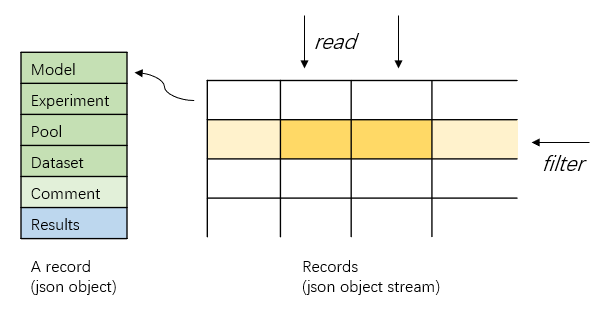

# GPLab

A lightweight benchmark lab for graph pooling methods under a unified protocol.

GPLab is built for one thing: **fair comparison of pooling layers**. It keeps the backbone, optimization setup, and dataset pipeline consistent so the pooling choice becomes the main variable.



## Why GPLab

Graph pooling papers are often hard to compare directly because training pipelines differ. GPLab standardizes the experiment loop and logs each run as a structured JSON record for reproducibility and later querying.

Core goals:
- Swap pooling methods via CLI or config, without touching model code.
- Keep one consistent 2-layer sparse GNN backbone across methods.
- Record config + metadata + per-run metrics as append-only JSONL.
- Support both built-in pooling and plugin-based custom pooling.

## Design Protocol

GPLab intentionally uses a **unified sparse-backbone protocol**:
- Sparse poolers (`topkpool`, `sagpool`, `asapool`, `sparsepool`) run natively.
- Dense-style poolers (`mincutpool`, `diffpool`, `densepool`) are wrapped by an adapter that:
1. Converts sparse graph batches to dense.
2. Applies dense pooling.
3. Converts outputs back to sparse.

This keeps downstream layers identical across pooling methods, which improves benchmark comparability.

## Project Layout

```text
GPLab/
  main.py                    # CLI entrypoint and experiment driver
  training.py                # train/test loops
  querry.py                  # JSONL result query utility
  model/
    Model.py                 # model base class
    Classifer_Sum.py         # primary graph classifier
  layers/
    resolver.py              # conv/pool resolver + plugin loading
    functional.py            # readout and pooling helpers
    pool/
      PoolAdapter.py         # dense->sparse adapter protocol
      SAGPool.py             # customized SAGPooling
      SparsePool.py          # custom sparse pooling
  utils/
    dataset.py               # TU dataset loading/splitting
    reproducibility.py       # seeds and deterministic loaders
    data.py                  # dense/sparse conversion helpers
    io.py                    # runtime metadata and printing
  config/
    model.toml               # model defaults
    experiment.toml          # experiment defaults
    seeds                    # optional seed list file
  examples/
    custom_pool_plugin.py    # plugin example
    logs/                    # sample JSONL logs
```

## Installation

GPLab is a Python project built around PyTorch + PyG.

Required runtime packages:
- `torch`
- `torch-geometric`
- `torcheval`
- `typer`
- `toml`
- `rich`
- `tqdm`
- `numpy`

Example setup (adjust CUDA/PyTorch wheels for your environment):

```bash
python3 -m venv .venv
source .venv/bin/activate
pip install torch torch-geometric torcheval typer toml rich tqdm numpy
```

## Quick Start

Run one experiment:

```bash
python3 main.py --pooling sagpool --pool-ratio 0.5 --dataset PROTEINS
```

Append result to JSONL:

```bash
python3 main.py \
  --pooling sagpool \
  --pool-ratio 0.5 \
  --dataset PROTEINS \
  --logging runs/tu_pooling.jsonl
```

Batch script example:

```bash
bash utils/main.sh
```

## Built-in Pooling Methods

Available built-ins:
- `nopool`
- `topkpool`
- `sagpool`
- `asapool`
- `sparsepool`
- `mincutpool`
- `diffpool`
- `densepool`

## Custom Pooling Plugin

You can pass a factory path in `<python_module>:<factory_name>` format:

```bash
python3 main.py \
  --pooling examples.custom_pool_plugin:build_pool \
  --pool-ratio 0.6 \
  --dataset PROTEINS
```

Recommended factory signature:

```python
def build_pool(
    in_channels: int,
    ratio: float = 0.5,
    avg_node_num=None,
    nonlinearity="relu",
):
    ...
```

GPLab first calls the full signature above, then falls back to `(in_channels, ratio)` for backward compatibility.

## Configuration

### `config/model.toml`
Model backbone and head:
- `hidden_features`
- `nonlinearity`
- `p_dropout`
- `conv_layer` (`GCN`, `GraphConv`, `GIN`)
- `pre_gnn` and `post_gnn` MLP channel lists

### `config/experiment.toml`
Experiment control:
- `runs`, `epochs`, `patience`
- `lr`, `batch_size`
- `seed_mode` (`auto` by default, `file` to read seeds from file)
- `seed_base` (deterministic seed generator base in `auto` mode)
- `allow_duplicate_seeds` (default `false`, optional when you intentionally replay fixed duplicate seeds)
- `seeds` path (used when `seed_mode=file`)
- `train_ratio`, `val_ratio`

`test_ratio` is derived as `1 - train_ratio - val_ratio`.

## Reproducibility

GPLab tracks reproducibility at multiple levels:
- Seeded NumPy/Torch/Python random state.
- Seeded DataLoader generator + worker init seeds.
- Deterministic split fingerprint via `split_digest`.
- Full config snapshot (`model`, `experiment`, `pool`, `meta`) in each log record.
- Minimal `repro` block fields:
  - `seed_mode`, `seed_base`, `seeds`
  - `split_digest`, `split_ratio`
  - `dataset_id` (`name`, graph size summary)
  - `env` (`python`, `torch`, `torch_geometric`, device, cudnn flags)

### Standard Repro Workflow

1. Generate an experiment log record:

```bash
python3 main.py \
  --pooling sparsepool \
  --dataset PROTEINS \
  --logging runs/bench.jsonl \
  --comment "purpose=baseline;date=2026-03-20"
```

2. Query and check summary fields:

```bash
python3 querry.py runs/bench.jsonl --pool sparsepool --dataset PROTEINS --epoch
```

## Logged Record Schema

Each `main.py` run emits one JSON object. With `--logging`, objects are appended as JSONL.

Main fields:
- `model`
- `experiment`
- `pool`
- `dataset`
- `comment` (optional)
- `meta`
- `repro` (minimal reproducibility fields)
- `results.statistic` (`mean`, `std`)
- `results.data` (`val_loss`, `test_acc`, `epochs_stop`, per-run details)

## Query Results

Use `querry.py` to filter logs by pool, dataset, and comment:

```bash
python3 querry.py runs/tu_pooling.jsonl --pool sagpool --dataset PROTEINS --epoch
```

Reproducibility inspection:

```bash
python3 querry.py runs/tu_pooling.jsonl --show-repro
python3 querry.py runs/tu_pooling.jsonl --verify-repro
```

## Minimal Benchmark Template

Recommended template for pooled benchmark batches:

```bash
python3 main.py \
  --pooling sparsepool \
  --pool-ratio 0.5 \
  --dataset PROTEINS \
  --logging runs/bench_proteins.jsonl \
  --comment "purpose=pooling_benchmark;date=2026-03-20"
```

Recommended `comment` fields:
- `purpose=<task_or_hypothesis>`
- `date=<YYYY-MM-DD>`

## Known Limitations

- TU datasets only.
- Fixed backbone family (2-layer GNN with pre/post MLP).
- Dense pooling is benchmarked through the unified adapter protocol, not dense-only downstream stacks.
- Single-task graph classification only.

## Notes on Naming

A few filenames use legacy spellings (`querry.py`, `Classifer_*`). They are part of current public CLI/module paths, so treat them as stable unless refactoring end-to-end.
